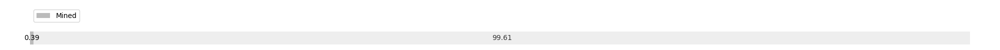

# Week 3

[prev](week0002.md) | [next](week0004.md)

- Block number: 833~1622

- Date: 2009-01-18 03:15:05~2009-01-25 03:15:04

- The number of transaction this week: 799

- Total utxo: 1574

- Theoretical Total Supply: 20999999.97690000 BTC

- Permanently Disappeared: 0.00000000 BTC

- Maximum Possible Total Supply: 20999999.97690000 BTC

- Current Supply: 81150.00000000 BTC (0.386%)

- Less than 3 years: 81150.00000000 BTC (100.000%)

- More than 3 years: 0.00000000 BTC (0.000%)

- More than 5 years: 0.00000000 BTC (0.000%)

- More than 10 years: 0.00000000 BTC (0.000%)

# Remarks

