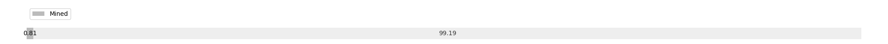

# Week 5

[prev](week0004.md) | [next](week0006.md)

- Block number: 2511~3388

- Date: 2009-02-01 03:15:05~2009-02-08 03:15:04

- The number of transaction this week: 901

- Total utxo: 3281

- Theoretical Total Supply: 20999999.97690000 BTC

- Permanently Disappeared: 0.00000000 BTC

- Maximum Possible Total Supply: 20999999.97690000 BTC

- Current Supply: 169450.00000000 BTC (0.807%)

- Less than 3 years: 169450.00000000 BTC (100.000%)

- More than 3 years: 0.00000000 BTC (0.000%)

- More than 5 years: 0.00000000 BTC (0.000%)

- More than 10 years: 0.00000000 BTC (0.000%)

# Remarks

