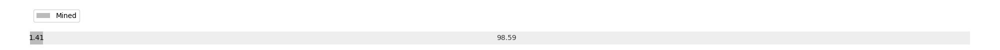

# Week 8

[prev](week0007.md) | [next](week0009.md)

- Block number: 5134~5900

- Date: 2009-02-22 03:15:05~2009-03-01 03:15:04

- The number of transaction this week: 772

- Total utxo: 5642

- Theoretical Total Supply: 20999999.97690000 BTC

- Permanently Disappeared: 0.00000000 BTC

- Maximum Possible Total Supply: 20999999.97690000 BTC

- Current Supply: 295050.00000000 BTC (1.405%)

- Less than 3 years: 295050.00000000 BTC (100.000%)

- More than 3 years: 0.00000000 BTC (0.000%)

- More than 5 years: 0.00000000 BTC (0.000%)

- More than 10 years: 0.00000000 BTC (0.000%)

# Remarks

