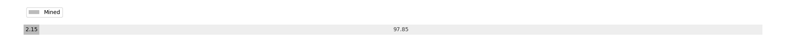

# Week 12

[prev](week0011.md) | [next](week0013.md)

- Block number: 8227~9016

- Date: 2009-03-22 03:15:05~2009-03-29 03:15:04

- The number of transaction this week: 796

- Total utxo: 8557

- Theoretical Total Supply: 20999999.97690000 BTC

- Permanently Disappeared: 0.00000000 BTC

- Maximum Possible Total Supply: 20999999.97690000 BTC

- Current Supply: 450850.00000000 BTC (2.147%)

- Less than 3 years: 450850.00000000 BTC (100.000%)

- More than 3 years: 0.00000000 BTC (0.000%)

- More than 5 years: 0.00000000 BTC (0.000%)

- More than 10 years: 0.00000000 BTC (0.000%)

# Remarks

