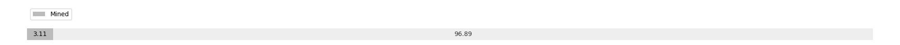

# Week 17

[prev](week0016.md) | [next](week0018.md)

- Block number: 12215~13046

- Date: 2009-04-26 03:15:05~2009-05-03 03:15:04

- The number of transaction this week: 836

- Total utxo: 12381

- Theoretical Total Supply: 20999999.97690000 BTC

- Permanently Disappeared: 0.00000000 BTC

- Maximum Possible Total Supply: 20999999.97690000 BTC

- Current Supply: 652350.00000000 BTC (3.106%)

- Less than 3 years: 652350.00000000 BTC (100.000%)

- More than 3 years: 0.00000000 BTC (0.000%)

- More than 5 years: 0.00000000 BTC (0.000%)

- More than 10 years: 0.00000000 BTC (0.000%)

# Remarks

