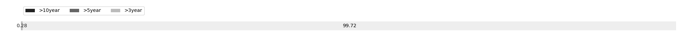

# Week 158

[prev](week0157.md) | [next](week0159.md)

- Block number: 161116~162185

- Date: 2012-01-08 03:15:05~2012-01-15 03:15:04

- The number of transaction this week: 46547

- Total utxo: 1259320

- Theoretical Total Supply: 20999999.97690000 BTC

- Permanently Disappeared: 0.01000001 BTC

- Maximum Possible Total Supply: 20999999.96689999 BTC

- Current Supply: 8109299.98999999 BTC (38.616%)

- Less than 3 years: 8086520.98999999 BTC (99.719%)

- More than 3 years: 22779.00000000 BTC (0.281%)

- More than 5 years: 0.00000000 BTC (0.000%)

- More than 10 years: 0.00000000 BTC (0.000%)

# Remarks

