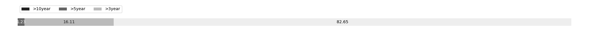

# Week 266

[prev](week0265.md) | [next](week0267.md)

- Block number: 283618~284836

- Date: 2014-02-02 03:15:05~2014-02-09 03:15:04

- The number of transaction this week: 448725

- Total utxo: 8957155

- Theoretical Total Supply: 20999999.97690000 BTC

- Permanently Disappeared: 10.19768817 BTC

- Maximum Possible Total Supply: 20999989.77921183 BTC

- Current Supply: 12370914.80231183 BTC (58.909%)

- Less than 3 years: 10224987.24374855 BTC (82.653%)

- More than 3 years: 1993560.53856328 BTC (16.115%)

- More than 5 years: 152367.02000000 BTC (1.232%)

- More than 10 years: 0.00000000 BTC (0.000%)

# Remarks

