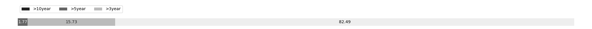

# Week 268

[prev](week0267.md) | [next](week0269.md)

- Block number: 286026~287245

- Date: 2014-02-16 03:15:05~2014-02-23 03:15:04

- The number of transaction this week: 453458

- Total utxo: 9189046

- Theoretical Total Supply: 20999999.97690000 BTC

- Permanently Disappeared: 10.19768817 BTC

- Maximum Possible Total Supply: 20999989.77921183 BTC

- Current Supply: 12431139.80231183 BTC (59.196%)

- Less than 3 years: 10254623.65981466 BTC (82.491%)

- More than 3 years: 1955949.08249717 BTC (15.734%)

- More than 5 years: 220567.06000000 BTC (1.774%)

- More than 10 years: 0.00000000 BTC (0.000%)

# Remarks

