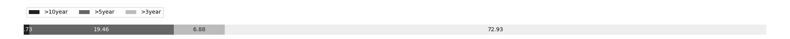

# Week 526

[prev](week0525.md) | [next](week0527.md)

- Block number: 560220~561248

- Date: 2019-01-27 03:15:05~2019-02-03 03:15:04

- The number of transaction this week: 2242446

- Total utxo: 64077598

- Theoretical Total Supply: 20999999.97690000 BTC

- Permanently Disappeared: 28.95502688 BTC

- Maximum Possible Total Supply: 20999971.02187312 BTC

- Current Supply: 17515583.54497312 BTC (83.408%)

- Less than 3 years: 12774449.61203190 BTC (72.932%)

- More than 3 years: 1205178.20771383 BTC (6.881%)

- More than 5 years: 3408588.70522739 BTC (19.460%)

- More than 10 years: 127367.02000000 BTC (0.727%)

# Remarks

