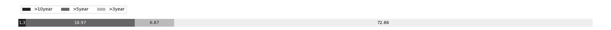

# Week 529

[prev](week0528.md) | [next](week0530.md)

- Block number: 563310~564350

- Date: 2019-02-17 03:15:05~2019-02-24 03:15:04

- The number of transaction this week: 2326591

- Total utxo: 66408064

- Theoretical Total Supply: 20999999.97690000 BTC

- Permanently Disappeared: 28.95502688 BTC

- Maximum Possible Total Supply: 20999971.02187312 BTC

- Current Supply: 17554358.54497312 BTC (83.592%)

- Less than 3 years: 12790062.42903043 BTC (72.860%)

- More than 3 years: 1206680.53888428 BTC (6.874%)

- More than 5 years: 3329198.51705841 BTC (18.965%)

- More than 10 years: 228417.06000000 BTC (1.301%)

# Remarks

