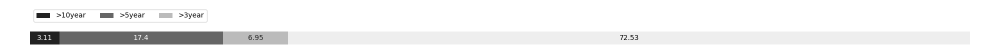

# Week 539

[prev](week0538.md) | [next](week0540.md)

- Block number: 573505~574611

- Date: 2019-04-28 03:15:05~2019-05-05 03:15:04

- The number of transaction this week: 2729847

- Total utxo: 75819201

- Theoretical Total Supply: 20999999.97690000 BTC

- Permanently Disappeared: 28.95502763 BTC

- Maximum Possible Total Supply: 20999971.02187237 BTC

- Current Supply: 17682621.04497237 BTC (84.203%)

- Less than 3 years: 12825323.39590963 BTC (72.531%)

- More than 3 years: 1229480.13142029 BTC (6.953%)

- More than 5 years: 3077450.45764245 BTC (17.404%)

- More than 10 years: 550367.06000000 BTC (3.112%)

# Remarks

